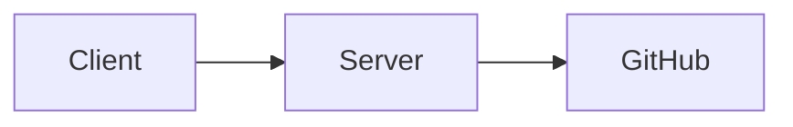

# Architecture v2

The Test Product is composed of three layers:

- **Client** — renders documentation pages.
- **Server** — scans GitHub for `mkdocs.yml` files and serves parsed content.
- **GitHub repository** — stores the `mkdocs.yml` and markdown source files.

