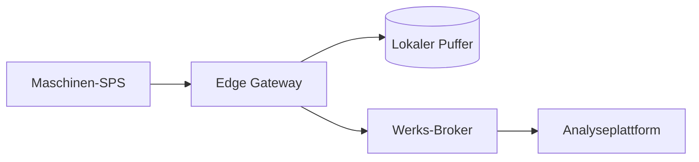

# Edge Gateway

Protokollübersetzung, Store-and-Forward-Pufferung und sichere Anbindung für
Maschinen, die nicht direkt mit der Werksplattform sprechen können.

## Highlights

- Übersetzt Modbus TCP, S7 und serielle Altdaten nach OPC UA oder MQTT.
- Puffert bis zu 72 Stunden Telemetrie bei Verbindungsausfall.
- Ausschließlich ausgehende TLS-Verbindung, keine eingehende Firewallregel nötig.

## Datenfluss

## Durchsatz

| Szenario | Tags | Abtastrate | CPU-Last |
| --- | --- | --- | --- |
| Kleine Linie | 500 | 1 s | 12 % |
| Mittlere Linie | 2500 | 500 ms | 38 % |
| Große Linie | 8000 | 250 ms | 71 % |

## Wartung

Firmware-Updates werden vorbereitet und beim nächsten geplanten Linienstopp
aktiviert. Ein Rollback-Slot hält immer das zuvor laufende Image bereit.
