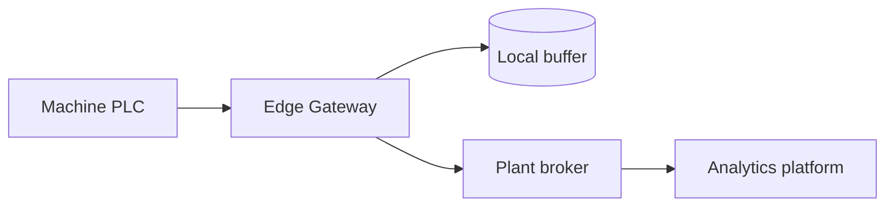

# Edge Gateway

Protocol translation, store-and-forward buffering and secure uplink for
machines that cannot talk to the plant platform directly.

## Highlights

- Translates Modbus TCP, S7 and legacy serial data into OPC UA or MQTT.
- Buffers up to 72 hours of telemetry during uplink outages.
- Outbound-only TLS connection, no inbound firewall rule required.

## Data flow

## Throughput

| Scenario | Tags | Sample rate | CPU load |
| --- | --- | --- | --- |
| Small line | 500 | 1 s | 12 % |
| Medium line | 2500 | 500 ms | 38 % |
| Large line | 8000 | 250 ms | 71 % |

## Maintenance

Firmware updates are staged and applied on the next planned line stop. A
rollback slot always keeps the previously running image.
