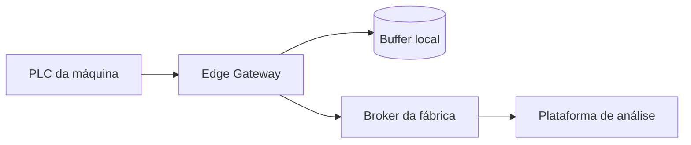

# Edge Gateway

Tradução de protocolos, buffer store-and-forward e ligação segura para
máquinas que não comunicam diretamente com a plataforma fabril.

## Destaques

- Traduz Modbus TCP, S7 e dados série legados para OPC UA ou MQTT.
- Guarda até 72 horas de telemetria durante falhas de ligação.
- Ligação TLS apenas de saída, sem necessidade de regra de firewall de entrada.

## Fluxo de dados

## Débito

| Cenário | Tags | Taxa de amostragem | Carga CPU |
| --- | --- | --- | --- |
| Linha pequena | 500 | 1 s | 12 % |
| Linha média | 2500 | 500 ms | 38 % |
| Linha grande | 8000 | 250 ms | 71 % |

## Manutenção

As atualizações de firmware são preparadas e aplicadas na próxima paragem
planeada. Um slot de rollback mantém sempre a imagem anterior.
